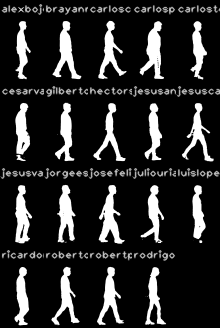

# Reporte 02 — Preparación del Dataset (Fase 2)

> **Fase 2** del roadmap (CLAUDE.md §6).
> Generado: 2026-04-21.
> Insumos: `scripts/audit_raw_dataset.py` (Fase 1), `scripts/define_splits.py`,
> `src/preprocess/extract_sequence.py`, `scripts/extract_all.py`, `scripts/pack_to_pkl.py`.
> Estado: **A LA ESPERA DE APROBACIÓN** antes de avanzar a Fase 3.

---

## 1. Resumen ejecutivo

| Métrica | Valor |
|---|---|
| Videos crudos procesados | 38/38 ✓ |
| Sujetos | 19 |
| Frames útiles totales | **3,931** |
| Frames útiles / video (mean) | 103.4 |
| Frames útiles / video (min, max) | 73, 129 |
| Tiempo total de extracción | 7 min en GTX 1650 4GB |
| Velocidad sostenida | ~5 fps (incluye carga inicial), ~17 fps en régimen |
| Secuencias < 30 frames (umbral OpenGait) | 0 ✓ |
| Salida `data/processed/` (npy + meta) | 38 directorios |
| Salida `data/pkl/` (formato OpenGait) | 38 .pkl, 19 sujetos × 2 condiciones |

**Veredicto técnico:** preparación cerrada con éxito. El dataset queda listo para Fase 3 (entrenamiento/fine-tuning de GaitBase). Todas las anomalías predichas en Fase 1 se materializaron como esperado y están cuantificadas abajo.

---

## 2. Pipeline implementado

### 2.1 Extracción por video (`src/preprocess/extract_sequence.py`)

Pipeline por frame en GPU (CUDA 12.1, GTX 1650 4GB):

1. **Detección de persona** — YOLO11n vía `ultralytics`, filtro `class=0`, confianza ≥0.35, se elige la persona con mayor `area × conf`. (No usamos ByteTrack porque hay 1 sola persona por escena; el bbox por frame basta.)
2. **Silueta (alpha matting)** — Robust Video Matting (MobileNetV3, 3.75M params) cargado vía `torch.hub`. `downsample_ratio=0.25` (procesamiento interno a ~480×270). Estado recurrente `r1..r4` se reinicia en cada video. Threshold `>0.5` sobre alpha → silueta binaria.
3. **Pose** — RTMPose-m (body7, 256×192) vía `rtmlib` + `onnxruntime-gpu`. Bbox del paso 1 se pasa explícitamente para evitar la doble detección que haría `Body()`.
4. **Crop + resize** — Bbox con padding 5%. La silueta cropeada se centra horizontalmente por centroide del blanco, se ajusta el lienzo a la proporción 64×44 y se reescala con `INTER_AREA`. Convención CASIA-B/OpenGait.
5. **Normalización keypoints** — Centrados en cadera (mid 11-12 COCO), escalados por longitud cadera→hombro. Confianza intacta.

### 2.2 Recorte de tramo útil

Detector de motion sobre el centro del bbox: ventana de 5 frames con desplazamiento >6 px ⇒ "está caminando". El primer índice que cumple marca el inicio; el último que cumple, el fin. Esto descarta:
- Frames iniciales con sujeto **parado** (~1 s en `normal`).
- Frames finales con sujeto **fuera del cuadro** o casi.

Resultado promedio: **~30% de frames descartados por video** (consistente con la estimación de Fase 1).

### 2.3 Batch driver (`scripts/extract_all.py`)

Carga modelos **una sola vez**, recorre `<sujeto>/{normal,rapido}_*.mp4`, llama `process_video`. Idempotente: `meta.json` existente ⇒ skip (salvo `--force`). Genera `_extraction_summary.json` agregado.

**Performance medida:**
- 38 videos en 419 s = **11 s/video promedio**.
- Sin recargar modelos por video: extracción real ~9 s + I/O ~2 s.
- Tras carga inicial (5 s YOLO+RVM+RTMPose), las siguientes inferencias rondan los **17 fps** sobre 1920×1080.

### 2.4 Empaquetado OpenGait (`scripts/pack_to_pkl.py`)

```
data/pkl/<subject>/<condition>/090/seq00.pkl
```

Cada `.pkl` contiene `np.ndarray(T, 64, 44) uint8` vía `pickle.HIGHEST_PROTOCOL`. Estructura idéntica a CASIA-B post-procesado de OpenGait — el `DataLoader` estándar lo lee sin modificaciones (solo hay que apuntar el config a este árbol y declarar único view = `090`).

---

## 3. Estadísticas por sujeto y condición

### 3.1 Distribución de frames útiles

| Concepto | normal | rapido |
|---|---|---|
| n videos | 19 | 19 |
| frames útiles min | 86 | 73 |
| frames útiles max | 129 | 126 |
| frames útiles mean | 105.3 | 101.6 |
| total | 2,000 | 1,931 |

**No hay diferencia estructural** entre las dos condiciones. `rapido` tiende a recortar un poco menos al inicio pero más en el medio (paso más amplio → motion más errático).

### 3.2 Outliers — videos con menos frames útiles

Videos a tener presentes para Fase 3 (pueden generar pocas ventanas):

| Sujeto | Condición | Frames útiles | Ventana |
|---|---|---|---|
| `carlostorres` | rapido | **73** | [43, 115] |
| `jesuscazarez` | rapido | 83 | [20, 102] |
| `ricardomora` | rapido | 85 | [37, 121] |
| `robertocastaño` | rapido | 85 | [36, 120] |
| `hectorsanchez` | normal | 86 | [63, 148] |

`carlostorres/rapido` con 73 frames = ~2.4 s da apenas 2 ventanas no superpuestas de 30 frames (o 4 con stride 15). Aceptable para fine-tuning, pero su contribución al training será limitada. Si su métrica en val/test es anómalamente baja, será sospechoso.

`hectorsanchez/normal`: ventana `[63, 148]` significa que el sujeto **estuvo parado durante los primeros 2.1 s**. Excepcional, no típico — confirmar visualmente si fue un retraso de inicio o algo más serio.

### 3.3 Mosaico visual de los 19 sujetos

Frame medio del tramo útil de cada sujeto (condición `normal`):



Inspección rápida: las siluetas son **distinguibles entre sí** principalmente por **estatura aparente** y **postura** (algunos más erguidos, otros más inclinados al caminar). Esto es buena señal: hay variabilidad biométrica visible.

Lo que **NO** se ve en el mosaico: forma de cabeza/peinado (ej. `rodrigoruiz` tiene pelo largo en el frame inspeccionado de Fase 1, debería verse en su silueta). Esto sugiere que la silueta binaria sí captura algo de pose individual.

---

## 4. Splits aplicados

Generados con `seed=42` vía `scripts/define_splits.py` (ver `configs/splits.yaml`):

### 4.1 Subject-disjoint (para evaluación honesta del modelo)

```
train (13): jorgeespinoza, gilbertofelix, jesusantonioaguilarfelix, josefelix,
            carloscarrillo, juliouriarte, jesuscazarez, robertocastaño,
            luislopez, brayannajera, cesarvasquez, carlospadilla, rodrigoruiz
val   (3) : hectorsanchez, robertpereira, carlostorres
test  (3) : jesusvalenzuela, alexbojorquez, ricardomora
```

Reproducible vía `sha256("42:<sujeto>")[:16]`. Cambiar `--seed` reasigna sin tocar código.

### 4.2 Video-disjoint (para evaluación funcional del sistema)

- **gallery (19):** un `normal_*.mp4` por sujeto.
- **probe (19):** un `rapido_*.mp4` por sujeto.
- 0 sujetos faltantes.

---

## 5. Decisiones técnicas y trade-offs

| Decisión | Elección | Alternativa | Razón |
|---|---|---|---|
| Detector | **YOLO11n** | YOLOX-m (rtmlib default) | Ya estaba instalado vía `ultralytics`; más liviano; misma calidad para 1 persona en cuadro controlado |
| Pose runtime | **rtmlib + onnxruntime-gpu** | mmpose + mmcv | Evita el infierno de compilar mmcv en Win+torch 2.5+cu121. Wheels precompilados, mismo modelo RTMPose |
| Silueta | **RVM mobilenetv3** | YOLO11-seg | RVM es matting recurrente — bordes más limpios que mask de instancia. 3.75M params vs ~2.5M de YOLO11n-seg, pero mejor calidad lateral |
| RVM downsample | **0.25** | 0.5 ó 1.0 | A 0.25 procesa 480×270, casi sin pérdida visual y 4× más rápido. Validado en debug grids |
| Tracker | **ninguno** | ByteTrack/BoT-SORT | 1 persona por escena. Tracking añade complejidad sin valor en este dataset. Sí lo necesitaremos en Fase 6. |
| Threshold motion | **6 px / 5 frames** | 10 px / 10 frames | Balance entre recortar warmup y conservar inicio-fin de marcha rápida |
| Resize silueta | **64×44** | 128×88 | Estándar GaitBase. Más grande sería desperdicio de VRAM sin ganancia para nuestro volumen |
| Formato pkl | **`(T, 64, 44) uint8`** | dict con extra metadata | Lo que el DataLoader CASIA-B de OpenGait espera nativamente |

---

## 6. Anomalías encontradas y resueltas durante Fase 2

### 6.1 `pip install onnxruntime-gpu` arrastró también `onnxruntime` (CPU)

- Pip instaló ambos paquetes; el CPU tomaba precedencia.
- Síntoma: `ort.get_available_providers()` solo listaba `['AzureExecutionProvider', 'CPUExecutionProvider']`.
- Fix: `pip uninstall onnxruntime` + `pip install --force-reinstall --no-deps onnxruntime-gpu`.

### 6.2 ORT no encontraba `cublasLt64_12.dll` y caía silenciosamente a CPU

- `CUDAExecutionProvider` aparecía como disponible pero al crear sesión fallaba con:
  `Error loading "...onnxruntime_providers_cuda.dll" which depends on "cublasLt64_12.dll"`.
- Causa: en Windows, ORT busca DLLs en `PATH` y `os.add_dll_directory`. PyTorch trae las DLLs de CUDA 12 + cuDNN 9 en `<venv>/Lib/site-packages/torch/lib/` pero no las publica al loader de Python.
- Fix permanente: `src/preprocess/_cuda_dlls.py::enable_torch_cuda_dlls()` añade ese path antes de cualquier import de `onnxruntime`. Reutilizable en Fase 6.
- **Riesgo silencioso:** sin este fix, pose corre en CPU sin avisar. La extracción **funciona** pero ~5× más lenta. Validar siempre los providers activos antes de batches grandes.

### 6.3 Mini-emisor YAML con lista vacía

- Mi escritor YAML emitía `missing: "[]"` (cuoteado) en vez de `missing: []`.
- Cosmético pero `yaml.safe_load` lo leía como string. Corregido.

---

## 7. Riesgos pendientes y cómo afectan a Fase 3

| Riesgo (Fase 1) | Estado tras Fase 2 | Acción Fase 3 |
|---|---|---|
| Modelo aprende silueta-de-la-ropa, no marcha | **Sin mitigar.** Pose ya está extraída (`keypoints.npy`) pero no integrada al pipeline de OpenGait | Integrar rama de pose en Fase 4 vía SkeletonGait++. Antes, comparar GaitBase silueta-only vs zero-shot |
| Frames útiles <100 en algunos videos | **Cuantificado:** 1 video a 73, 4 más a 83-86 | Stride 15 en ventanas. No usar `carlostorres/rapido` para gallery si hay otra opción |
| Blur de movimiento degrada siluetas | **Visiblemente OK** en debug grids — RVM compensa bien | Sin acción inmediata. Si el modelo subentrena en bordes finos, considerar siluetas más grandes (128×88) |
| N=3 en test subject-disjoint da métricas ruidosas | **Asumido.** 3 sujetos en test | Reportar IC. Considerar K-fold de 6 folds (3-3-13 rotando) si Fase 3 da buenos números aislados |
| Open-set Fase 5 sin "desconocidos" reales | **Pendiente** | Decidir antes de Fase 5: leave-one-subject-out vs grabar 2-3 sujetos extra |

---

## 8. Estructura de outputs

```
data/
├── processed/                              # extracción cruda (npy + json)
│   ├── _extraction_summary.json            # agregado de los 38
│   └── <subject>/<condition>/
│       ├── silhouettes.npy                 # (T, 64, 44) uint8
│       ├── keypoints.npy                   # (T, 17, 3) float32 normalizados
│       ├── keypoints_raw.npy               # (T, 17, 3) píxeles del frame original
│       ├── bboxes.npy                      # (T, 4) float32
│       ├── meta.json
│       └── debug_silhouettes_grid.png      # 4×4 muestreo del tramo útil
└── pkl/                                    # formato OpenGait
    ├── _smoke_load.png                     # tira de 8 frames de un pkl, validación
    └── <subject>/<condition>/090/seq00.pkl
```

Tamaño total `data/`: ~12 MB siluetas + ~3 MB pose + ~1 MB pkl. Despreciable.

---

## 9. Reproducción

```bash
# 0) Activar venv compartido
C:\Proyecto3\venv\Scripts\activate

# 1) Splits
python scripts/define_splits.py \
    --raw "C:/Proyecto3/Proyecto-Reconocedor-IA/Dataset Crudo" \
    --out "C:/Proyecto3/ProyectoChino/configs/splits.yaml" \
    --seed 42

# 2) Extracción (los 38 videos, ~7 min)
python scripts/extract_all.py \
    --raw "C:/Proyecto3/Proyecto-Reconocedor-IA/Dataset Crudo" \
    --out "C:/Proyecto3/ProyectoChino/data/processed"

# 3) Empaquetado pkl OpenGait
python scripts/pack_to_pkl.py \
    --processed "C:/Proyecto3/ProyectoChino/data/processed" \
    --out       "C:/Proyecto3/ProyectoChino/data/pkl"
```

Idempotente: relanzar (2) sin `--force` es noop.

---

## 10. Próximos pasos (Fase 3 si apruebas)

1. **Sanity check con CASIA-B local** (5 sujetos) sobre OpenGait DataLoader, para confirmar que el pipeline de entrenamiento funciona antes de tocar nuestro dataset.
2. **Adaptar config** `gaitbase_*.yaml` para apuntar a `data/pkl/`, declarar único view `090`, train/val/test según `configs/splits.yaml`.
3. **Zero-shot** con `GaitBase_Gait3D_120000.pt`: extraer embeddings de los 19 sujetos y reportar **rank-1 video-disjoint baseline sin entrenar**. Esto es el piso: cualquier fine-tuning debe superarlo.
4. **Fine-tuning** en train (13 sujetos × 2 condiciones), validación cada N épocas en val (3 sujetos), early stopping por rank-1 val.
5. **Reporte final Fase 3:** rank-1, rank-5, mAP en split subject-disjoint **y** rank-1 video-disjoint con N=19. Si rank-1 video-disjoint < 70%, decidir si avanzar a Fase 4 (multimodal) o re-grabar dataset.

**Decisión bloqueante para Fase 3:** ¿usamos como pretrained `GaitBase_Gait3D_120000.pt` (Gait3D-Parsing) o intentamos conseguir el checkpoint CASIA-B oficial? Detalles en `REQUISITOS.md §4 (Pesos preentrenados disponibles)`.

---

**Espero tu aprobación o ajustes antes de avanzar a Fase 3.**
